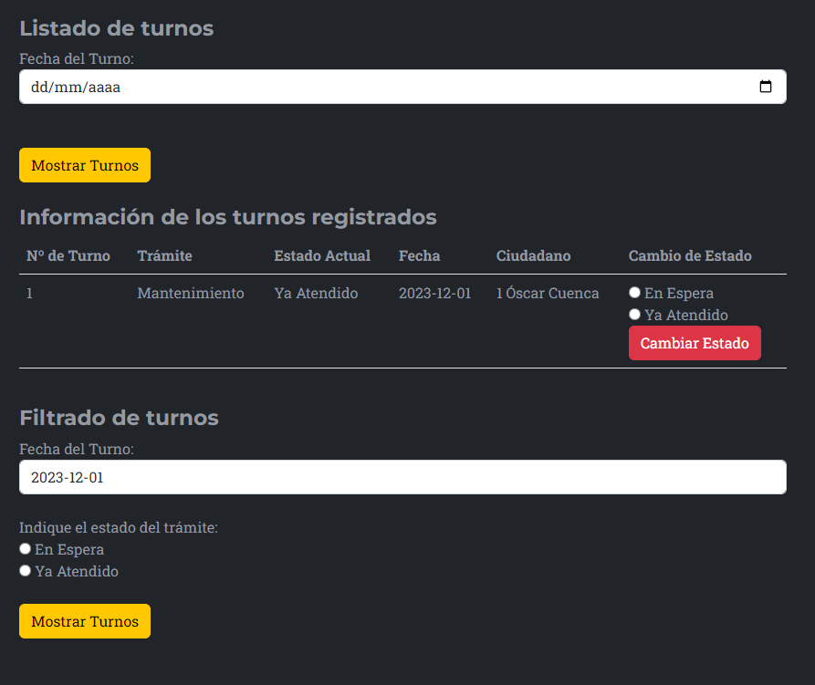

# Turnero - Sistema de registro de incidencias por turnos
Se trata de una aplicación desarrollada para el gobierno que permite el regitro de los ciudadanos en la Base de Datos,
y que, accediendo al sistema a través del ID asignado a su usuario, podra registrar incidencias.

## Estado del proyecto
Se considera que la versión inicial de la aplicación está completa, ya que es funcional
y su código está comentado.

## Requisitos del entorno de desarrollo para la integración
Será necesario contar con OpenJDK17, Apache Tomcat 9.0.83 y al menos un navegador web.
También será necesario contar con acceso a un servicio SQL en el que se pueda crear una 
base de datos llamada **turnero**, en la que se crearán automáticamente las tablas ciudadanos
y turnos.

## Funcionamiento
Para poder utilizar la aplicación, será necesario conocer los datos de acceso tanto a Apache 
Tomcat como a MySQL. Tras acceder a ambos, al iniciar la aplicación, se mostrará en el 
navegador web el panel de registro de usuarios y turnos.

En este panel el ciudadano podrá acceder con su Id al sistema, se podrá registrar, o
podrá consultar los turnos de una fecha determinada.

### Acceso de ciudadano
En el caso de que ya esté dado de alta, podrá introducir su Id, y en caso de ser correcto, 
el sistema mostrará un mensaje de bienvenida con su nombre, una tabla con sus datos,
y un formulario, en el que se solicitarán el tipo de trámite que se desea registrar, el 
estado, y la fecha, y por último, se confirma el Id del usuario con el que se va a registrar
el turno, el cual no se puede modificar.
Al registrar el turno, se comprueban que los campos se hayan rellenado correctamente, y 
al crearse el registro en la Base de Datos, se vuelve al panel inicial de la aplicación,
saliendo del perfil de usuario.

### Registro de ciudadano
Al acceder a la aplicación, o si se deja en blanco el campo donde se solicita el Id de 
ciudadano, se mostrará el formulario de registro, en el que se deberá introducir el nombre,
apellido y DNI del ciudadano, y se dará de alta en el sistema, autogenerándose el Id, 
y mostrándose junto al resto de datos automáticamente al pulsar en Enviar.

### Listado de turnos
Para mostrar los turnos registrados, es necesario que se especifique la fecha de la que se 
desean mostrar los turnos. Si en la fecha indicada existen turnos ya creados, se mostrarán, 
indicando su id, el trámite, su estado, la fecha, el id, nombre y apellido del ciudadano que
lo registró, y por último un pequeño formulario que permitirá cambiar el estado si lo desea.
En caso de no encontrar turnos en la fecha indicada, no se mostrará ningún dato.

#### Filtrado de turnos
En caso de encontrar turnos en la fecha indicada, se mostrará bajo la tabla donde se muestran
los datos de los turnos, un formulario en el que se indica la fecha de los turnos que se van 
a filtrar, la cual no es modificable, y 2 botones, que nos permitirán seleccionar el estado
de los turnos que deseamos que se muestren. En el caso de no encontrar turnos con el estado 
indicado en la fecha seleccionada, no se mostrará ningún dato.

## Tecnologías utilizadas
- Java + Servlets
- JSP
- Bootstrap
    - Plantilla utilizada: Agency (https://startbootstrap.com/theme/agency)
- JPA
- MySQL
- Colecciones
- Objetos
- Funciones lambda
- Optionals
- Streams

## Información sobre derechos de autor y licencias
La plantilla de Bootstrap utilizada es gratuita y de licencia libre, al igual que la
aplicación como tal. 

## Operaciones que pueden realizar los usuarios
- [x] Agregar un nuevo turno
- [x] Listar turnos
- [x] Filtrar turnos

## Diagrama de clases de la aplicación
